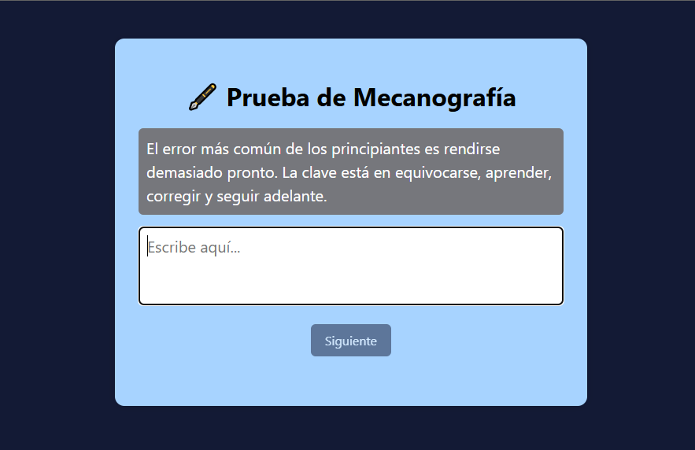

# ⌨️ Prueba de Mecanografía Interactiva

Este proyecto es una aplicación web interactiva para medir tu velocidad y precisión al escribir una frase. Ideal para practicar mecanografía y mejorar tu rendimiento frente al teclado. 
---

## 🎯 Características

- ✅ Frases aleatorias para practicar
- 🎨 Coloreo en tiempo real:
  - Texto correcto: ✅ verde
  - Texto incorrecto: ❌ rojo
  - Texto pendiente: blanco
- ⏱️ Medición automática del tiempo
- 📊 Resultados detallados:
  - Tiempo total
  - Velocidad en Palabras Por Minuto (WPM)
  - Porcentaje de errores

---

## 📸 Vista previa



---

## 🚀 Cómo usar

1. Clona el repositorio:
   ```bash
   git clone https://github.com/RGBCode0/prueba-macanografia.git
2. Abre el archivo index.html en tu navegador.

3. Al momemento de escribir una letra en el area de texto empieza la medición del tiempo

## 🛠️ Tecnologías utilizadas
- HTML5

- CSS3

- JavaScript 

## 🌐 Demo en línea
Puedes probar la aplicación directamente:

📎 https://tu-usuario.github.io/prueba-mecanografia

 
## Créditos
Desarrollado por Rael Gabriel Bautista
Sígueme para más proyectos: github.com/RGBCode0
